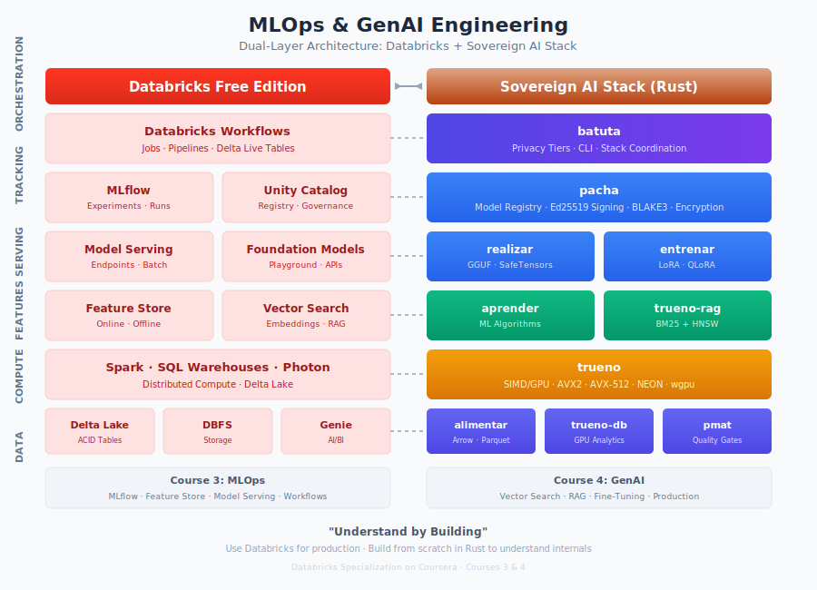

# MLOps & GenAI Engineering on Databricks

**Courses 3 & 4 of the Databricks Specialization on Coursera**

[](https://github.com/paiml/DB-mlops-genai/actions/workflows/ci.yml)
[](https://paiml.github.io/DB-mlops-genai/)
[](https://www.databricks.com/)
[](https://www.rust-lang.org/)

## Overview

Master MLOps and GenAI engineering through hands-on labs on **Databricks Free Edition**, with deep understanding gained by building equivalent systems from scratch using the **Sovereign AI Stack** (Rust).

| Course | Title | Duration | Focus |
|--------|-------|----------|-------|
| **3** | MLOps Engineering | 30 hrs | MLflow, Feature Store, Model Serving |
| **4** | GenAI Engineering | 34 hrs | Vector Search, RAG, Fine-Tuning |

## Architecture



## Prerequisites

- Courses 1-2 of this specialization (Lakehouse + Data Engineering)
- Basic Rust familiarity (ownership, cargo)
- Databricks Free Edition account

## Installation

```bash
# Clone repository
git clone https://github.com/paiml/DB-mlops-genai.git
cd DB-mlops-genai

# Install Python dependencies
pip install uv && uv sync --all-extras

# Install Rust toolchain (for Sovereign AI Stack)
curl --proto '=https' --tlsv1.2 -sSf https://sh.rustup.rs | sh

# Install Sovereign AI Stack tools
cargo install batuta realizar pmat
```

## Usage

```bash
# Setup environment
make setup

# Run quality checks
make check

# Run demos
make demos

# Run specific course tests
make test-course3
make test-course4
```

## Design Philosophy

**Dual-layer pedagogy:**
- **Databricks layer** — Use production MLOps and GenAI tools effectively
- **Sovereign AI Stack layer** — Build equivalent systems in Rust to understand internals

*"Understand by building"* creates deeper retention than tutorials alone.

## Repository Structure

```
demos/
  course3/           # MLOps demos (weeks 1-6)
  course4/           # GenAI demos (weeks 1-7)
labs/
  course3/           # MLOps hands-on labs
  course4/           # GenAI hands-on labs
examples/
  databricks/        # Databricks notebook examples
  sovereign/         # Sovereign AI Stack (Rust) examples
docs/
  outline.md         # Course outline
```

## Course 3: MLOps Engineering

| Week | Topic | Databricks | Sovereign AI |
|------|-------|------------|--------------|
| 1 | Experiment Tracking | MLflow | reqwest client |
| 2 | Feature Engineering | Feature Store | trueno + alimentar |
| 3 | Model Training | AutoML | aprender |
| 4 | Model Serving | Model Serving | realizar |
| 5 | Production Quality | Workflows | batuta + pmat |
| 6 | Capstone | End-to-end | Full stack |

## Course 4: GenAI Engineering

| Week | Topic | Databricks | Sovereign AI |
|------|-------|------------|--------------|
| 1 | LLM Serving | Foundation Models | realizar |
| 2 | Prompt Engineering | Playground | batuta |
| 3 | Vector Search | Vector Search | trueno-rag |
| 4 | RAG Pipelines | Databricks RAG | trueno-rag |
| 5 | Fine-Tuning | Databricks FT | entrenar |
| 6 | Production | Model Serving | batuta |
| 7 | Capstone | End-to-end | Full stack |

## Certification Alignment

| Skill | Databricks Certification |
|-------|-------------------------|
| MLflow Tracking & Registry | ML Associate |
| Feature Engineering | ML Associate |
| Model Serving | ML Associate |
| Foundation Model APIs | GenAI Engineer |
| Vector Search & RAG | GenAI Engineer |
| Fine-Tuning | GenAI Engineer |

## Development

```bash
make check        # Lint + test
make format       # Auto-format code
make test-course3 # Course 3 tests only
make test-course4 # Course 4 tests only
```

## Contributing

1. Fork the repository
2. Create a feature branch (`git checkout -b feature/my-feature`)
3. Run quality checks (`make check`)
4. Commit changes (`git commit -m 'Add feature'`)
5. Push to branch (`git push origin feature/my-feature`)
6. Open a Pull Request

See [CONTRIBUTING.md](CONTRIBUTING.md) for detailed guidelines.

## License

MIT
